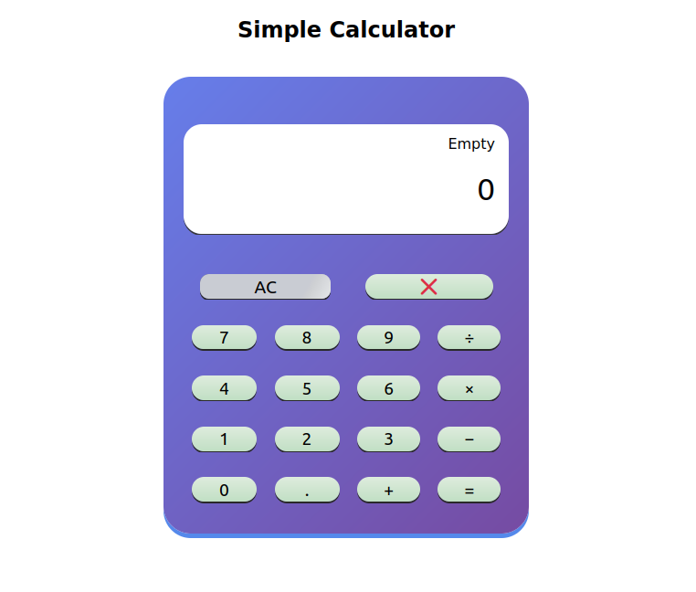

# Calculator App

This is a simple calculator web application created using HTML, CSS, and JavaScript. It allows users to perform basic arithmetic operations such as addition, subtraction, multiplication, and division.



## Features

- Addition, subtraction, multiplication, and division operations.
- Clear button to reset the input and result.
- Responsive design for various screen sizes.

## Demo

You can try the calculator live at [Demo](https://anand-jaiswal-in.github.io/simple-calculator/).

## Getting Started

To run this calculator app locally, follow these steps:

1. Clone this repository:

```bash
git clone https://github.com/anand-jaiswal-IN/calculator-app.git
```

2. Open the project folder:

```bash
cd calculator-app
```

3. Open the `index.html` file in your web browser.

## Usage

1. Enter numbers and perform calculations by clicking the buttons.

2. Click the "C" button to clear the input and result.

## Acknowledgments

- This project was inspired by [source of inspiration, if any].
- Special thanks to [contributors or libraries used].

## Contact

If you have any questions or suggestions, feel free to contact the project maintainer:

Anand Jaiswal
anandjaiswal68339@gmail.com
